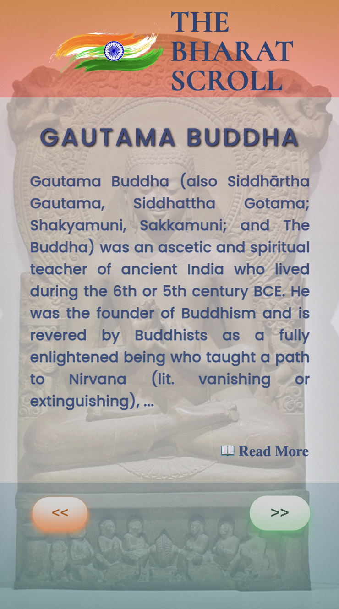

# The Bharat Scroll

This project is a tribute to the rich history of Bharat. It represents the History of Bharat in a chronological order. I have used 
the **Wikipedia API** to get the articles of different time periods of Bharatiya history.

## Tech Stack Used

- HTML, CSS, JS (with jquery) for frontend,
- Node.js and Express for running the server and making API calls (backend) and 
- Wikipedia API to get data and images for the articles.

## Desktop 🖥

## Mobile 📱 

✌️
#### SPIRIT OUT 4️⃣2️⃣
